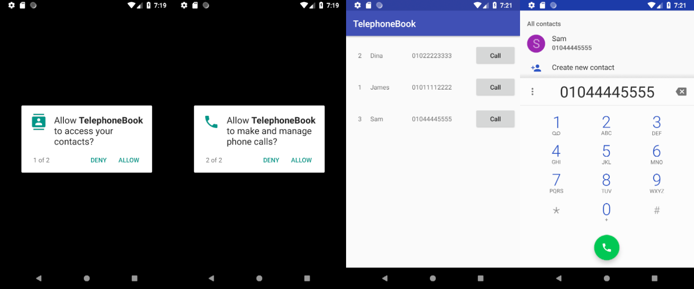

# TelephoneBook

#### RecyclerView를 사용하여 전화부 만들기

#### 필요 권한
* 전화번호부 읽고/쓰기 권한
* 전화걸기 권한

````java
static String[] permissions = {
  Manifest.permission.READ_CONTACTS,
  Manifest.permission.WRITE_CONTACTS,
  Manifest.permission.CALL_PHONE
};
````

### 동작시현


